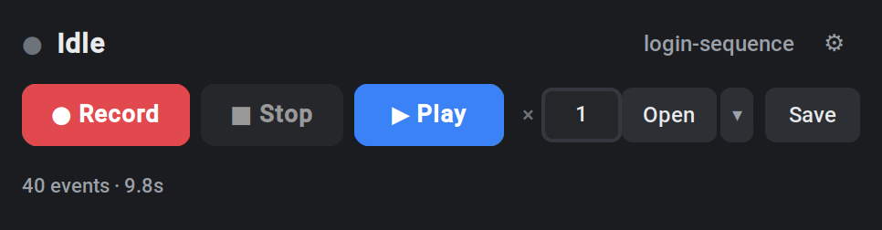
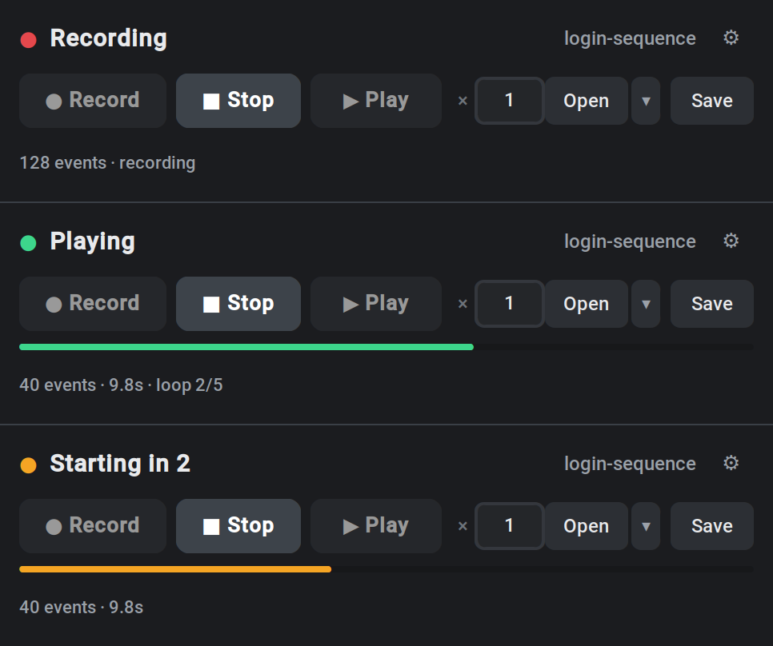
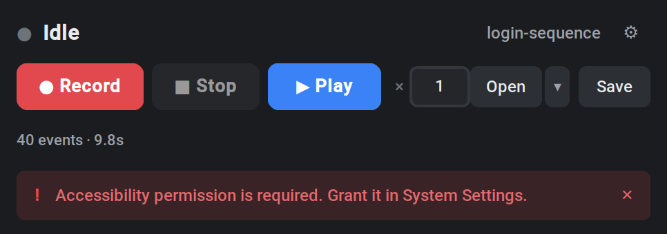
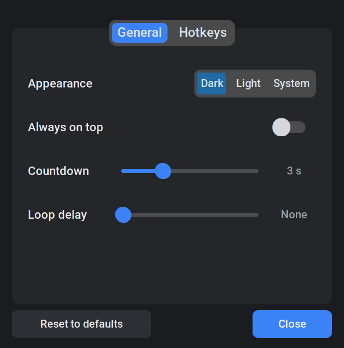
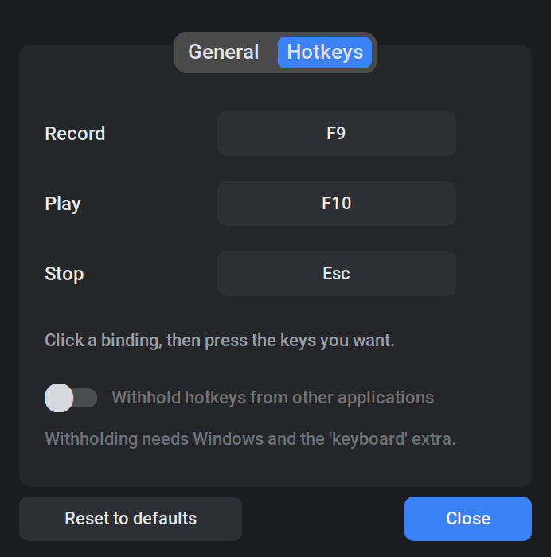
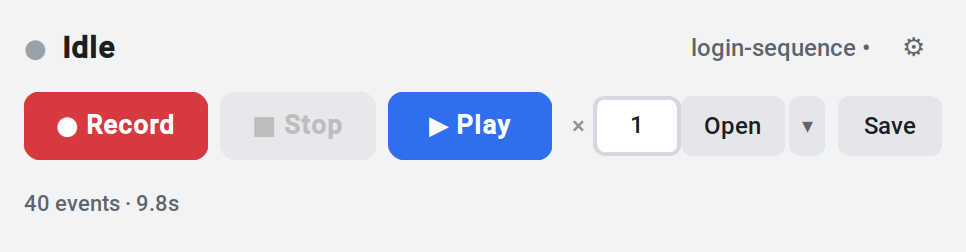

# EventPlayback


A lightweight application for recording and playing back mouse and keyboard input.



## Table of Contents

- [Features](#features)
- [Requirements](#requirements)
- [Download](#download)
- [Installation](#installation)
- [Usage](#usage)
- [Controls](#controls)
- [Interface](#interface)
- [Hotkeys](#hotkeys)
- [Settings](#settings)
- [File Format](#file-format)
- [Architecture](#architecture)
- [Development](#development)
- [Notes](#notes)
- [Troubleshooting](#troubleshooting)
- [Build](#build)
- [License](#license)

## Features

| | |
|---|---|
| **Record and replay** | Captures mouse movement, clicks, scrolling and keystrokes, and replays them with the original timing |
| **Repeat** | Any number of repetitions, or until you stop it, with an optional pause between them |
| **Global hotkeys** | F9, F10 and Escape work while another application has focus, and can be rebound by pressing the keys you want |
| **Visible progress** | A progress bar and a loop counter while a macro replays, and a countdown before recording or playback starts |
| **Light and dark** | Follows the system theme, or is pinned to either from the settings window |
| **Macro files** | Saved as readable JSON, with a recently-opened list and a prompt before an unsaved recording is lost |
| **Small** | Two dependencies (pynput, customtkinter), a single executable on Windows |
| **Testable** | A layered architecture whose core knows nothing about the GUI or the operating system |

## Requirements

- Python 3.10 or higher
- Windows, macOS or Linux (X11)
- Platform specific permissions:
  - **Windows**: no special privileges required
  - **macOS**: Accessibility and Input Monitoring permission must be granted in
    System Settings before input can be captured or replayed
  - **Linux**: an X11 session; Wayland does not expose the required APIs

## Download

### Executable File (Recommended)

**Download from GitHub Releases** (latest stable version):
- Download the latest version of `EventPlayback.exe` from the [Releases page](https://github.com/iam74k4/EventPlayback/releases)
- After downloading, you can use it by simply running the exe file

**Download from GitHub Actions Artifacts** (development version or manual builds):
- Select the latest build from the [Actions page](https://github.com/iam74k4/EventPlayback/actions)
- Download `EventPlayback-exe` from the "Artifacts" section
- Note: Artifacts are kept for 30 days only

Pre-built executables are provided for Windows only. On macOS and Linux, run
from source.

### Run from Source Code

If Python is installed, you can also run directly from the source code.

## Installation

```bash
pip install -r requirements.txt
```

Or install the package itself, which also provides an `eventplayback` command:

```bash
pip install -e .
```

To additionally withhold hotkeys from other applications (Windows only, see
[Hotkeys](#hotkeys)):

```bash
pip install -e ".[suppress]"
```

## Usage

```bash
python main.py
```

Equivalently:

```bash
python -m eventplayback   # requires the package to be installed
```

## Controls

| Button | Function |
|--------|----------|
| ● Record | Start recording after the countdown |
| ■ Stop | Stop recording/playback, or cancel the countdown |
| ▶ Play | Start playback after the countdown |
| ×[number] | Loop count (0 = until stopped, shown as ∞) |
| Open / ▾ / Save | Load a macro, pick a recent one, or save |
| ⚙ | Settings |

| Shortcut | Function |
|----------|----------|
| Ctrl+O | Open a macro |
| Ctrl+S | Save the macro |
| Ctrl+, | Open settings |
| Enter | Play, while the loop field has focus |

These are ordinary shortcuts and only work while the window has focus. The
hotkeys below are global.

## Interface

The window is one screen: what is happening, the controls, and the totals.
Rows appear only when they have something to say, and the window resizes to
suit, so nothing is a permanent empty space.

```
┌──────────────────────────────────────────────────┐
│ ● Idle                       login-sequence •  ⚙ │  state · macro · settings
│ ● Record   ■ Stop   ▶ Play   ×[1]  Open ▾  Save  │  controls
│ ▓▓▓▓▓▓▓▓▓▓▓▓░░░░░░░░░░░░░░░░░░░░░░░░░░░░░░░░░░░░ │  progress, while running
│ 40 events · 9.8s · loop 2/5                      │  totals
│ ! Accessibility permission is required.        ✕ │  messages, when there are any
└──────────────────────────────────────────────────┘
```

### States

A coloured dot carries the state, pulsing gently rather than flashing the
whole window. Recording counts events as they arrive; playback fills the bar
across each repetition; the countdown empties it as the wait runs out.



| Dot | State |
|-----|-------|
| Grey | Idle |
| Amber | Counting down before recording or playback |
| Red | Recording |
| Green | Replaying |

### Messages

Messages have their own row, so they never cover up what the application is
doing. Confirmations fade after a few seconds; something you need to act on,
such as a missing permission, waits until you dismiss it.



### Settings




### Light and dark

`appearance_mode` can follow the system or be pinned. Colours are defined once
in `ui/theme.py` as light/dark pairs, so both modes stay in step.



## Hotkeys

| Key | Function |
|-----|----------|
| F9 | Start/Stop recording |
| F10 | Start/Stop playback |
| Escape | Stop |

Hotkeys are global and work while other applications have focus. Whichever keys
are bound are automatically excluded from recordings, so pressing F9 to stop
does not end up in the macro. Combinations such as `ctrl+shift+f9` are accepted.

To change one, open the settings window (⚙ or Ctrl+,), go to the Hotkeys tab,
click the binding and press the keys you want. Global hotkeys are released
while that window is open, so pressing F9 rebinds it instead of starting a
recording.

### Suppression

By default a hotkey is observed but still reaches the focused application, so
F9 also arrives wherever you were working. Setting `suppress_hotkeys` to `true`
swallows the key instead:

```bash
pip install "eventplayback[suppress]"   # installs the optional keyboard library
```

This requires Windows. On macOS and Linux the setting is ignored and the
application says so on startup, because the library it relies on needs root
privileges there.

## Settings

Everything here can be changed in the settings window (⚙ or Ctrl+,) and takes
effect immediately; the file is written when the window closes. Editing it by
hand still works.

| Platform | Location |
|----------|----------|
| Windows | `%APPDATA%\EventPlayback\settings.json` |
| macOS | `~/Library/Application Support/EventPlayback/settings.json` |
| Linux | `$XDG_CONFIG_HOME/EventPlayback/settings.json` (default `~/.config`) |

```json
{
  "loop_count": 1,
  "loop_delay": 0.0,
  "countdown_seconds": 3,
  "always_on_top": true,
  "appearance_mode": "dark",
  "last_directory": "",
  "recent_files": [],
  "hotkeys": { "record": "f9", "play": "f10", "stop": "esc" },
  "suppress_hotkeys": false
}
```

`loop_delay` is the pause inserted between repetitions, in seconds.
`appearance_mode` is `dark`, `light` or `system`. `recent_files` is the
recently-opened list behind the ▾ button; entries that no longer exist are
dropped at startup.

Unreadable or out-of-range values fall back to the defaults, so a damaged
settings file never prevents the application from starting. Hotkeys accept
combinations such as `ctrl+shift+f9`.

## File Format

Macros are saved in JSON format. The structure is as follows:

```json
{
  "version": 1,
  "name": "Macro Name",
  "created_at": "2024-01-01T00:00:00",
  "events": [
    {
      "type": "mouse_move",
      "timestamp": 0.0,
      "x": 100,
      "y": 200
    }
  ]
}
```

`type` is one of `mouse_move`, `mouse_click`, `mouse_scroll`, `key_press` or
`key_release`, and `timestamp` is seconds since the start of the recording.
Files written by earlier versions have no `version` field and are still
accepted.

## Architecture

```
src/eventplayback/
├── core/                    Recording and playback. No GUI, no OS input library.
│   ├── events.py            Event / EventType
│   ├── macro.py             Macro, validation and the file format
│   ├── recorder.py          Input capture
│   ├── player.py            PlaybackEngine (synchronous) + Player (threaded)
│   └── backends/
│       ├── base.py          InputSource / InputSynthesizer / HotkeyListener / Clock
│       ├── pynput_backend.py  The only module that imports pynput
│       ├── keyboard_backend.py  Optional, Windows: suppressible hotkeys
│       └── fake.py          In-memory backends and a virtual clock, for tests
├── services/                Settings, macro files, hotkey registration
├── ui/
│   ├── theme.py             Design tokens, as (light, dark) colour pairs
│   ├── state.py             State -> appearance, as a pure function
│   ├── keycapture.py        Tk key event -> hotkey string
│   ├── tooltip.py           Hover labels for the toolbar
│   ├── banner.py            The message row
│   ├── settings_dialog.py   The settings window
│   └── app.py               The customtkinter window
└── platform_support.py      Everything that has to know which OS this is
```

The input library and the clock are injected rather than constructed in place.
That is what allows the whole of `core` to be tested head-lessly on any
platform, and what keeps pynput confined to a single module.

## Development

```bash
pip install -r requirements-dev.txt
pytest        # unit tests; no display server required
ruff check .  # lint
```

The test suite exercises `core`, `services`, `ui.state`, `ui.theme` and
`ui.keycapture`, none of which import pynput or customtkinter. That is the
reason the colour palette, the state-to-appearance rules and the key
translation live outside the widget code: they are the parts worth testing,
and they can be tested without a display.

## Notes

**Security Warning**: This application records all keyboard input. Please stop recording when entering passwords, credit card numbers, or other sensitive information. Recorded macro files may contain input content, so please manage them appropriately.

## Troubleshooting

### Hotkeys Not Working

- **macOS**: grant Accessibility and Input Monitoring permission in System
  Settings > Privacy & Security, then restart the application
- **Linux**: confirm the session is X11 (`echo $XDG_SESSION_TYPE`); Wayland is
  not supported
- Check if other applications are using the same hotkeys
- Rebind the conflicting hotkey in the settings window (⚙ > Hotkeys)

### Hotkeys Also Reach the Application Underneath

That is the default. See [Suppression](#suppression).

### Playback Timing Is Uneven

Playback asks Windows for a 1 ms timer tick while it runs, because the default
~15.6 ms tick would round a 20 ms gap up to 31 ms. If the request is refused,
the application compensates by busy-waiting through the last tick, which is
accurate but uses more CPU for the duration of the replay. Both cases are
logged at startup of the run.

### Recording Not Working Properly

- Check if mouse and keyboard inputs are being detected correctly
- Confirm the input permissions listed under [Requirements](#requirements)
- Restart the application

### Playback Not Working Properly

- Check if the recorded macro file is in the correct format
- Check if other applications are interfering during playback
- If an error message is displayed, check the message shown in the GUI

### Coordinates Are Off on a Scaled Display

Recording and playback must run at the same display scaling. On Windows the
application declares per-monitor DPI awareness at startup to keep coordinates
consistent.

## Build

### Local Build

```bash
pip install pyinstaller
pyinstaller --onefile --windowed --paths src --name EventPlayback main.py
```

### Automatic Build (GitHub Actions)

Every push and pull request runs lint and tests. Releasing builds the exe and
publishes it to GitHub Releases, and can be started from either end.

**From a tag**, the usual way:

```bash
git tag -a v1.2.0 -m "EventPlayback v1.2.0"
git push origin v1.2.0
```

**From the Actions tab**, for anywhere that cannot push a tag: run the *Build
and Release* workflow, choose the branch, and enter the version (`1.2.0`, no
leading `v`). The workflow creates the tag itself once the build succeeds, then
publishes the release. Leave the version empty for a plain build with no
release.

Either way the version must match `pyproject.toml` on the ref being released;
the workflow stops if it does not, which is what catches a release started from
a branch that never got the version bump.

## License

MIT License
